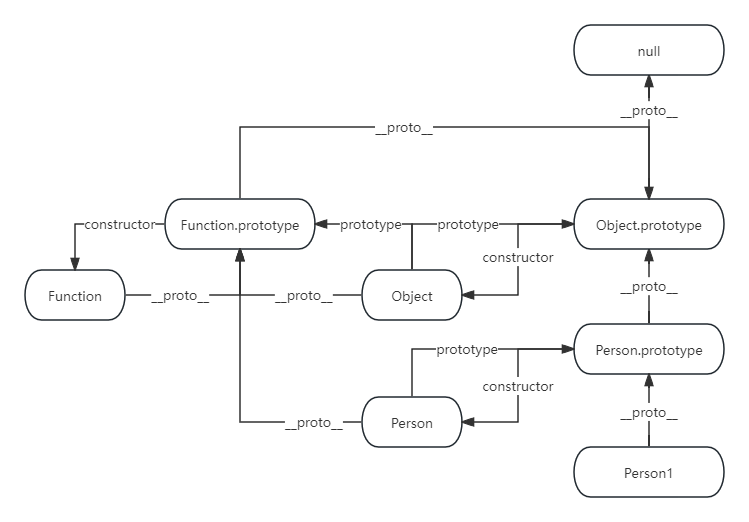
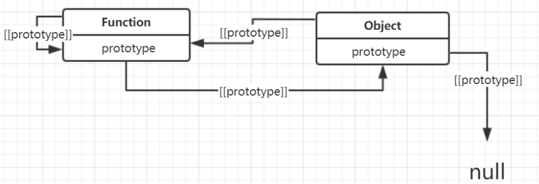

# 前端面试汇总

- [前端面试汇总](#前端面试汇总)
  - [前端相关](#前端相关)
    - [var, let, const](#var-let-const)
    - [ES6 新特性](#es6-新特性)
    - [构建工具如何实现 ES6 到 ES5 的版本转换](#构建工具如何实现-es6-到-es5-的版本转换)
    - [js 判读数据类型](#js-判读数据类型)
    - [数组新增方法](#数组新增方法)
    - [ES Module 和 commonJS](#es-module-和-commonjs)
    - [Promise 函数](#promise-函数)
    - [JS 箭头函数和普通函数区别](#js-箭头函数和普通函数区别)
    - [JS 异步编程](#js-异步编程)
    - [跨域请求 CORS](#跨域请求-cors)
    - [渲染方式](#渲染方式)
    - [闭包应用场景](#闭包应用场景)
    - [原型链](#原型链)
    - [CSS3 新特性](#css3-新特性)
    - [XSS，CSRF](#xsscsrf)
    - [JS VS TS](#js-vs-ts)
    - [Vue 和 React 区别](#vue-和-react-区别)
    - [JS 遍历数组的方法](#js-遍历数组的方法)
    - [5. **reduce() 方法**](#5-reduce-方法)
    - [6. **for...of 循环**](#6-forof-循环)
    - [Mac 地址和本地 ip 的对应关系](#mac-地址和本地-ip-的对应关系)
    - [Mac 地址存在于那个数据库](#mac-地址存在于那个数据库)
    - [mysql 数据索引是用什么数据结构实现的](#mysql-数据索引是用什么数据结构实现的)
    - [SQL 中左连接和右链接区别](#sql-中左连接和右链接区别)
    - [iOS 中 Tab VIew 实现原理和重用机制](#ios-中-tab-view-实现原理和重用机制)
    - [iOS 点击事件，最终响应的 view 是什么，事件的传递链是](#ios-点击事件最终响应的-view-是什么事件的传递链是)
    - [App 的生命周期的有哪些](#app-的生命周期的有哪些)
    - [js new 关键字的四个工作过程](#js-new-关键字的四个工作过程)
    - [js 如何判断对象数据类型](#js-如何判断对象数据类型)
    - [重排链表](#重排链表)
    - [40 亿个无符号整型数组，无序不重复，给出一个数，如何判断这个数在不在数组中（内存细分）](#40-亿个无符号整型数组无序不重复给出一个数如何判断这个数在不在数组中内存细分)
    - [JWT 原理](#jwt-原理)
    - [异步请求方法](#异步请求方法)
    - [虚拟 DOM 和真实 DOM](#虚拟-dom-和真实-dom)
    - [NextTick](#nexttick)
    - [Proxy](#proxy)
    - [图片懒加载](#图片懒加载)
    - [Composition API 方法](#composition-api-方法)
    - [CSS 垂直居中](#css-垂直居中)
    - [async 和 defer 区别](#async-和-defer-区别)
    - [Canvas 和 SVG 比较](#canvas-和-svg-比较)
    - [开发前端组件时候应该遵循什么开发代码设计原则](#开发前端组件时候应该遵循什么开发代码设计原则)
    - [Vue 组件生命周期](#vue-组件生命周期)
    - [React 组件生命周期](#react-组件生命周期)
    - [前端页面层级很多如何传递参数](#前端页面层级很多如何传递参数)
    - [compute 和 watch 区别](#compute-和-watch-区别)
    - [v-if 和 v-show 区别](#v-if-和-v-show-区别)
    - [v-if 相较于 v-show 优势](#v-if-相较于-v-show-优势)
    - [Vue 组件通信](#vue-组件通信)
    - [搭建 UI 自动化测试平台需要注意什么](#搭建-ui-自动化测试平台需要注意什么)
    - [封装一个云函数需要注意问题](#封装一个云函数需要注意问题)
    - [截流和防抖的概念](#截流和防抖的概念)
    - [Vue DOM 渲染方式](#vue-dom-渲染方式)
    - [Vue 的虚拟 DOM 渲染方式：](#vue-的虚拟-dom-渲染方式)

## 前端相关

### var, let, const

|                | var   | Let   | Const |
| -------------- | ----- | ----- | ----- |
| 变量提升       | yes   | no    | no    |
| 暂时性死区     | no    | Yes   | yes   |
| 块级作用域     | no    | Yes   | Yes   |
| 重复声明       | yes   | no    | no    |
| 修改声明的变量 | yes   | yes   | no    |
| 使用           | least | other | most  |

### ES6 新特性

1. **箭头函数**：提供了一种更简洁的函数定义方式，同时改变了 `this` 的指向。

   ```javascript
   const add = (a, b) => a + b;
   ```

2. **解构赋值**：允许从数组或对象中提取值，赋给变量。

   ```javascript
   const [a, b] = [1, 2];
   const { x, y } = { x: 1, y: 2 };
   ```

3. **模板字面量**：提供了更便捷的字符串拼接方式，支持多行字符串和嵌入变量。

   ```javascript
   const name = "Alice";
   const greeting = `Hello, ${name}!`;
   ```

4. **let 和 const**：引入了块级作用域的变量声明方式，`let` 和 `const`。

   ```javascript
   let count = 0;
   const PI = 3.14;
   ```

5. **类和继承**：引入了类的概念，更接近传统面向对象编程的写法，并提供了更直观的继承机制。

   ```javascript
   class Animal {
     constructor(name) {
       this.name = name;
     }
     speak() {
       console.log(`${this.name} makes a noise.`);
     }
   }
   ```

6. **模块化**：引入了模块化的语法，使得 JavaScript 代码可以更好地组织和管理。

   ```javascript
   // 导出
   export function add(a, b) {
     return a + b;
   }
   // 导入
   import { add } from "./math";
   ```

7. **use strict**：严格模式

8. **Promise**：引入了 Promise 对象，用于更好地处理异步操作。

   ```javascript
   const promise = new Promise((resolve, reject) => {
     setTimeout(() => {
       resolve("done");
     }, 1000);
   });
   ```

### 构建工具如何实现 ES6 到 ES5 的版本转换

[【前端面试题】Babel 是如何进行 ES6 及以上版本语法转换的\_哔哩哔哩\_bilibili](https://www.bilibili.com/video/BV15r421u7yz/?spm_id_from=333.337.search-card.all.click&vd_source=a11f40747ab601aa19d609bcaa570c76)

1.  解析 parse：生成 AST 抽象语法树

2.  转换 transform：运用各种插件指导代码如何进行转换

    ```json
    "presets": [
    	[
            "@babel/preset-env"
            {
                "useBuiltIns": "usage",
                "corejs": 3
            }
        ]
    l,
    ```

3.  生成 generate

### js 判读数据类型

[【JavaScript】判断 JavaScript 数据类型！\_哔哩哔哩\_bilibili](https://www.bilibili.com/video/BV1Jz421R7RP/?spm_id_from=333.788&vd_source=a11f40747ab601aa19d609bcaa570c76)

1.  先判断是不是 null
2.  typeof 判读是原始类型还是引用类型
3.  Qbject.prototype.tostring.call()

### 数组新增方法

- Array.from()
- Array.of()
- copyWithin()
- find()
- findlndex()
- fill()
- entries()
- keys()
- values includes()
- flat()
- flatMap()

### ES Module 和 commonJS

CommonJS（简称 CJS）和 ES Module（简称 ESM）是两种不同的模块系统，主要用于在 JavaScript 中组织和管理模块化代码。它们之间有以下几点不同：

1. **语法差异**：
   - CommonJS 使用 `require()` 导入模块，以及 `module.exports` 或 `exports` 导出模块。
   - ES Module 使用 `import` 导入模块，以及 `export` 导出模块。
2. **加载时机**：
   - CommonJS 模块是同步加载的，模块会在运行时动态加载。
   - ES Module 是异步加载的，模块会在静态解析阶段加载。
3. **作用域**：
   - CommonJS 模块是运行时加载，每个模块都有自己的顶层作用域，模块中定义的变量和函数只在当前模块中可见。
   - ES Module 是编译时加载，每个模块都有自己的词法作用域，模块中定义的变量和函数默认是私有的，需要显式导出才能被其他模块访问。
4. **静态分析**：
   - CommonJS 的模块路径可以动态生成，因此不容易进行静态分析和优化。
   - ES Module 的模块路径是静态的，因此可以在编译时进行静态分析和优化。
5. **浏览器支持**：
   - CommonJS 最初是为服务器端环境设计的，Node.js 提供了对 CommonJS 的支持。在浏览器端，CommonJS 需要使用打包工具（如 Browserify 或 Webpack）进行转换和加载。
   - ES Module 是 ECMAScript 标准的一部分，在现代浏览器中已经得到了广泛的支持，不需要额外的转换和加载工具。

综上所述，CommonJS 和 ES Module 是两种不同的模块系统，它们有着不同的语法、加载时机、作用域和静态分析特性，适用于不同的场景和环境。在 Node.js 等环境中，通常使用 CommonJS 模块系统；在现代浏览器和新的 JavaScript 项目中，通常使用 ES Module 模块系统。

### Promise 函数

1.  promise.all()

    Promise.all()方法接受一个数组作为参数,p1、p2、p3 都是 Promise 实例

    只有 p1、p2、p3 的状态都变成 fulfilled，p 的状态才会变成 fulfilled，此时 p1、p2、p3 的返回值组成一个数组，传递给 p 的回调函数

    只要 p1、p2、p3 之中有一个被 rejected，p 的状态就变成 rejected，此时第一个被 reject 的实例的返回值，会传递给 p 的回调函数

2.  promise.race()

    只要 p1、p2、p3 之中有一个实例率先改变状态，p 的状态就跟着改变。那个率先改变的 Promise 实例的返回值，就传递给 p 的回调函数

3.  promise.allSettled()

    只有 p1,p2 ,p3 实例都返回结果，不管是 fulfilled 还是 rejected，包装实例才会结束

    所以，Promise.all()无法确定所有请求都结束，如果你需要知道所有入参的异步操作的所有结果，或者需要知道这些异步操作是否全部结束，应该使用 promise.allSettled()

4.  Promise.any()

    当传入的 promise 数组中有任意一个完成时就会终止，会忽略到所有被拒绝掉的 promise，直到第一个 promise 完成。若传入所有的 promise 被拒绝则会执行拒绝回调。

    ```
    promise 如果构造函数分别先后传入 resolve(1),resolve(2),resolve(3)
    最后的值是多少

    特性：状态凝固
    ```

### JS 箭头函数和普通函数区别

**语法：**

- 箭头函数使用箭头（`=>`）来定义，通常在函数表达式中使用。
- 普通函数使用关键字 `function` 来定义，可以是函数声明或函数表达式。

**this 关键字的绑定 :**

- 箭头函数中的 `this` 关键字会捕获其外层（外围函数或全局作用域）的 `this` 值，并保持不变。这被称为词法作用域。
- 普通函数中的 `this` 关键字的值在运行时根据调用方式（方法调用、构造函数、全局调用等）而变化。

普通函数 this 指向最近的调用对象，箭头函数 this 指向函数所处的位置

```swift
const obj = {
    name: 'John',
    greetArrow: () => {
        console.log(`Hello, ${this.name}`);
    },
    greetRegular: function() {
        console.log(`Hello, ${this.name}`);
    }
};

obj.greetArrow();    // 输出 "Hello, undefined"，因为 this 指向全局对象
obj.greetRegular();  // 输出 "Hello, John"，this 正确指向 obj
```

**arguments 对象：**

- 箭头函数没有自己的 `arguments` 对象，它会继承外层函数（如果有）的 `arguments` 对象。
- 普通函数有自己的 `arguments` 对象，其中包含传递给函数的所有参数。

```swift
function regularFunction() {
    console.log(arguments);
}

const arrowFunction = () => {
    console.log(arguments); // 这里会报错，因为箭头函数没有自己的 arguments 对象
}

regularFunction(1, 2, 3); // 输出 { '0': 1, '1': 2, '2': 3 }
arrowFunction(1, 2, 3);   // 报错：arguments is not defined
```

**构造函数：**

- 箭头函数不能用作构造函数，无法使用 `new` 关键字来实例化。
- 普通函数可以用作构造函数，并且可以使用 `new` 来创建对象实例。

```swift
const ArrowConstructor = () => {
    this.value = 42;
};

const RegularConstructor = function() {
    this.value = 42;
};

const arrowObj = new ArrowConstructor();   // 报错：ArrowConstructor is not a constructor
const regularObj = new RegularConstructor(); // 创建了一个 regularObj 实例
```

### JS 异步编程

**回调函数（Callback Functions）：** 回调函数是一种常见的处理异步操作的方式。你可以将一个函数作为参数传递给异步函数，当异步操作完成时，回调函数会被调用。

```javascript
function fetchData(url, callback) {
  // 模拟异步操作
  setTimeout(function () {
    const data = "Some data from " + url;
    callback(data);
  }, 1000);
}

fetchData("example.com", function (data) {
  console.log(data);
});
```

**Promise：** Promise 是一种更强大的异步编程模式，它可以处理异步操作的成功和失败情况，并提供链式调用的方式来组织代码。

```javascript
function fetchData(url) {
  return new Promise(function (resolve, reject) {
    // 模拟异步操作
    setTimeout(function () {
      const data = "Some data from " + url;
      resolve(data); // 成功时调用 resolve
      // 或者 reject("Error message"); // 失败时调用 reject
    }, 1000);
  });
}

fetchData("example.com")
  .then(function (data) {
    console.log(data);
  })
  .catch(function (error) {
    console.error(error);
  });
```

**async/await：** async/await 是建立在 Promise 基础上的异步编程语法糖，它可以使异步代码看起来更像同步代码，提高可读性。

```javascript
async function fetchData(url) {
  return new Promise(function (resolve, reject) {
    setTimeout(function () {
      const data = "Some data from " + url;
      resolve(data);
    }, 1000);
  });
}

async function fetchDataAndLog() {
  try {
    const data = await fetchData("example.com");
    console.log(data);
  } catch (error) {
    console.error(error);
  }
}

fetchDataAndLog();
```

**事件驱动编程：** JavaScript 是事件驱动的语言，许多操作是通过事件来触发和处理的。你可以使用事件监听器来处理异步事件。

```javascript
document.getElementById("myButton").addEventListener("click", function () {
  // 异步操作
  setTimeout(function () {
    console.log("Button clicked asynchronously.");
  }, 1000);
});
```

**Generator 和 yield：** Generator 是一种特殊的函数，它可以在执行过程中暂停和恢复。通过 yield 关键字，你可以实现可暂停的异步操作。

```javascript
function* fetchGenerator() {
  // 异步操作
  yield "Some data from example.com";
}

const iterator = fetchGenerator();
const result = iterator.next();

if (!result.done) {
  result.value.then(function (data) {
    console.log(data);
  });
}
```

### 跨域请求 CORS

跨域（Cross-Origin）是指在 Web 开发中，浏览器的安全策略限制了页面中发起跨域请求的行为。跨域问题是由浏览器的同源策略（Same-Origin Policy）引起的，同源策略要求页面中的脚本只能与其来源相同的资源进行交互，包括协议（http/https）、域名和端口号。

同源策略的存在是为了保护用户的信息安全，防止恶意网站窃取用户数据。如果不遵守同源策略，就会出现跨域问题，浏览器会阻止这种跨域行为。

常见导致跨域的情况包括：

1. **不同协议**：比如从 `http://example.com` 页面请求 `https://example.com` 的资源。
2. **不同域名**：比如从 `http://example.com` 页面请求 `http://another.com` 的资源。
3. **不同端口**：比如从 `http://example.com:8080` 页面请求 `http://example.com:3000` 的资源。

解决跨域问题的常见方法包括：

1. 使用 JSONP：JSONP 是一种利用 `<script>` 标签的跨域技术，但它只支持 GET 请求，且需要对服务端进行特殊处理。
2. CORS（跨域资源共享）：服务端设置 CORS 头部，允许跨域请求。
3. 代理：通过在同域的服务端转发请求实现跨域访问。
4. iframe：通过在同域的页面内嵌一个隐藏的 iframe，跨域通信通过 iframe 的 window 对象实现。

[前端开发中如何解决跨域问题\_哔哩哔哩\_bilibili](https://www.bilibili.com/video/BV1vU4y1N721/?spm_id_from=333.880.my_history.page.click&vd_source=a11f40747ab601aa19d609bcaa570c76)


CORS 请求中服务器端的相关标头：

1. **Access-Control-Allow-Origin**: 控制哪些域名可以访问资源，可以具体指定域名，也可以是 _ 表示允许任何域名；如果服务器支持带有 cookie 的跨域请求，则不可以使用 _，必须指定具体的域名；
2. **Access-Control-Allow-Methods**: 控制允许的请求方法；
3. **Access-Control-Allow-Credentials**: 是否允许带 cookie，值为 `true` 表示允许，不允许则不发送此标头，如果设置为 `true`，则 Access-Control-Allow-Origin 不能为 \*；
4. **Access-Control-Allow-Headers**: 控制客户端请求头中允许携带哪些 header，通常需要包含 Content-Type 表示允许带有内容类型的标头；
5. **Access-Control-Expose-Headers**: 控制客户端通过 `xhr.getResponseHeaders()` 能够访问到哪些 header，不设置则只能访问到 Cache-Control、Content-Language、Content-Length、Content-Type 等几个基本的响应头；
6. **Access-Control-Max-Age**: 设置预检请求的缓存时间，单位为秒。在此时间内的预检请求则可以不发送预检请求。

CORS 请求中客户端的相关标头：

1. **Access-Control-Request-Method**: 客户端发起的预检请求中，表明实际请求将使用的请求方法；
2. **Access-Control-Request-Headers**: 客户端在发起预检请求时表明实际请求中将携带的 header。

### 渲染方式

- **服务器端渲染（Server-Side Rendering，SSR）：** 服务器在响应请求时就会生成完整的 HTML 页面，并将其发送到浏览器。这样，浏览器只需展示已经渲染好的页面。这种方式的优势在于对搜索引擎友好，但可能会增加服务器负担。
- **客户端渲染（Client-Side Rendering，CSR）：** 浏览器接收到一个基本的 HTML 页面，然后通过 JavaScript 请求数据，动态生成和更新页面内容。这种方式使得页面的交互性更强，但可能导致搜索引擎对内容的索引不够友好，因为搜索引擎在加载时无法看到完整的页面内容。

前端渲染（Front-End Rendering）是指在客户端浏览器中通过 JavaScript 来动态地创建和更新 HTML、CSS 和 DOM（文档对象模型），而不是在服务器端生成完整的 HTML 再传输给客户端。

在前端渲染中，主要涉及到以下几个方面：

1. **DOM 树构建**：渲染引擎使用 HTML 解析器（调用 XML 解析器）解析 HTML 文档，将各个 HTML 元素逐个转化成 DOM 节点，从而生成 DOM 树。

2. **CSSOM 树构建**：CSS 解析器解析 CSS，并将其转化为 CSS 对象，将这些 CSS 对象组装起来，构建 CSSOM 树。
3. **渲染树构建**：DOM 树和 CSSOM 树都构建完成以后，浏览器会根据这两棵树构建出一棵渲染树。
4. **页面布局**：渲染树构建完毕之后，元素的位置关系以及需要应用的样式就确定了，这时浏览器会计算出所有元素的大小和绝对位置。
5. **页面绘制**：页面布局完成之后，浏览器会将根据处理出来的结果，把每一个页面图层转换为像素，并对所有的媒体文件进行解码。

对于这五个流程，每一阶段都有对应的产物：DOM 树、CSSOM 树、渲染树、盒模型、界面。

DOM 树中不可见的节点都没有包含到渲染树中。为了构建渲染树，浏览器上大致做了如下工作：遍历 DOM 树中所有可见节点，并把这些节点加到布局中，而不可见的节点会被布局树忽略掉，如 head 标签下面的全部内容，再比如 p.p 这个元素，因为它的属性包含 dispaly:none，所以这个元素也没有被包含进渲染树中。如果给元素设置了 visibility: hidden 属性，那这个元素会出现在渲染树中，因为具有这个样式的元素是需要占位的，只不过不需要显示出来。

这里在查找的过程中，出于效率的考虑，会从 CSSOM 树的叶子节点开始查找，对应在 CSS 选择器上也就是从选择器的最右侧向左查找。所以，不建议使用标签选择器和通配符选择器来定义元素样式。

除此之外，同一个 DOM 节点可能会匹配到多个 CSSOM 节点，而最终的效果由哪个 CSS 规则来确定，就是样式优先级的问题了。当一个 DOM 元素受到多条样式控制时，样式的优先级顺序如下：`内联样式 > ID选择器 > 类选择器 > 标签选择器 > 通用选择器 > 继承样式 > 浏览器默认样式。`（内 I 类标通继浏）

### 闭包应用场景

闭包是 JavaScript 中非常强大的特性，它的应用场景非常广泛。以下是一些常见的闭包应用场景：

1. **封装私有变量和函数：** 闭包可以创建私有作用域，使得内部变量和函数对外部不可见。这种方式可以用于创建模块化的代码，防止变量和函数污染全局命名空间。

   ```javascript
   function counter() {
     let count = 0;
     return function () {
       return ++count;
     };
   }

   const increment = counter();
   console.log(increment()); // 输出 1
   console.log(increment()); // 输出 2
   ```

2. **保存状态：** 闭包可以用于保存函数的执行状态，使得函数可以记住上次调用时的状态。

   ```javascript
   function makeAdder(initial) {
     return function (number) {
       return initial + number;
     };
   }

   const add5 = makeAdder(5);
   console.log(add5(2)); // 输出 7
   ```

3. **实现函数柯里化：** 闭包可以用于实现函数柯里化，即将多个参数的函数转换为一系列单参数函数。

   ```javascript
   function curry(fn) {
     return function curried(...args) {
       if (args.length >= fn.length) {
         return fn(...args);
       } else {
         return function (...args2) {
           return curried(...args.concat(args2));
         };
       }
     };
   }

   function add(a, b, c) {
     return a + b + c;
   }

   const curriedAdd = curry(add);
   console.log(curriedAdd(1)(2)(3)); // 输出 6
   ```

4. **实现函数记忆化（Memoization）：** 闭包可以用于缓存函数的计算结果，提高函数执行效率。

   ```javascript
   function memoize(fn) {
     const cache = {};
     return function (...args) {
       const key = JSON.stringify(args);
       if (!cache[key]) {
         cache[key] = fn(...args);
       }
       return cache[key];
     };
   }

   function fibonacci(n) {
     if (n <= 1) return n;
     return fibonacci(n - 1) + fibonacci(n - 2);
   }

   const memoizedFibonacci = memoize(fibonacci);
   console.log(memoizedFibonacci(10)); // 输出 55
   ```

这些只是闭包的一些常见应用场景，它还有许多其他用途，根据实际需求灵活应用。

### 原型链

[【JavaScript】js 原型链、构造函数和类\_哔哩哔哩\_bilibili](https://www.bilibili.com/video/BV15T411t725/?spm_id_from=333.337.search-card.all.click&vd_source=a11f40747ab601aa19d609bcaa570c76)

原型链是 JavaScript 中用于实现继承和对象属性查找的一种机制。每个对象都有一个原型（prototype），并且可以通过原型链来查找属性和方法。

在 JavaScript 中，每个对象都有一个内部属性 `[[Prototype]]`，它指向该对象的原型。当我们访问一个对象的属性时，如果对象本身没有这个属性，JavaScript 引擎会沿着原型链向上查找，直到找到该属性或者到达原型链的顶端（即 `null`）为止。

如果我们尝试访问一个对象的属性，而这个属性不存在于该对象本身或者它的原型链上，那么将返回 `undefined`。

例如：

```javascript
// 第一步定义类对象
class Person {
  constructor(name, age) {
    this.name = name;
    this.age = 18;
  }
  sayName = function () {
    console.log(this.name);
  };
}
/* or */
function Person(name) {
  this.name = name;
  this.age = 18;
  this.sayName = function () {
    console.log(this.name);
  };
}

// 第二步 创建实例
let person = new Person("person");
```

原型链的图如下：



每个对象的**proto**都是指向它的构造函数的原型对象 prototype 的

```js
person1.__proto__ === Person.prototype;
```

构造函数是一个函数对象，是通过 Function 构造器产生的

```js
Person.__proto__ === Function.prototype;
```

原型对象本身是一个普通对象，而普通对象的构造函数都是 Object

```js
Person.prototype.__proto__ === Object.prototype;
```

所有的构造器都是函数对象，函数对象都是 Function 构造产生的

```js
Object.__proto__ === Function.prototype;
```

Object 的原型对象也有**proto**属性指向 null，null 是原型链的顶端

```js
Object.prototype.__proto__ === null;
```

其中比较特殊的理解难点是 Function 和 Object 互为原型对象，在对方的原型链上, 关系图如下



### CSS3 新特性

CSS3 引入了许多新的特性和增强功能，使得网页设计更加灵活、美观和交互性。以下是一些 CSS3 的新特性：

1. **选择器**：新增了许多新的选择器，如属性选择器、伪类选择器、伪元素选择器等，使得选择元素更加灵活。

2. **盒子模型**：引入了 `box-sizing` 属性，可以控制盒子模型的计算方式，包括 `content-box` 和 `border-box`。

3. **边框和背景**：新增了 `border-radius` 属性，可以实现圆角边框；`box-shadow` 属性可以添加阴影效果；`background-size` 属性可以控制背景图片的大小；`background-clip` 属性可以控制背景的裁剪方式等。

4. **颜色和渐变**：新增了 RGBA 颜色表示方式和 HSLA 颜色表示方式，使得颜色表示更加灵活；引入了线性渐变（`linear-gradient`）和径向渐变（`radial-gradient`）等渐变效果。

5. **字体**：新增了 `@font-face` 规则，可以引入自定义字体；`font-size-adjust` 属性可以调整不同字体之间的大小差异。

6. **文本效果**：引入了 `text-shadow` 属性，可以添加文本阴影效果；`text-overflow` 属性可以控制文本溢出的显示方式等。

7. **布局**：新增了 `flexbox` 布局模型，可以方便地实现灵活的布局；`grid` 布局模型可以实现更复杂的网格布局。

8. **动画和过渡**：新增了 `@keyframes` 规则，可以定义动画序列；`transition` 属性可以实现过渡效果，使得元素的状态变化更加平滑。

9. **媒体查询**：引入了媒体查询（`@media`）功能，可以根据不同的设备或条件来应用不同的样式，实现响应式设计。

10. **多列布局**：新增了多列布局（`multi-column`）功能，可以实现文字分栏布局。

### XSS，CSRF

[XSS CSRF 攻击及预防](https://www.bilibili.com/video/BV1p7411A7u9/?spm_id_from=333.880.my_history.page.click&vd_source=a11f40747ab601aa19d609bcaa570c76)

XSS（跨站脚本攻击）和 CSRF（跨站请求伪造）是两种常见的网络安全攻击方式，它们会导致以下问题：

1. **XSS 攻击**：XSS 攻击指的是攻击者通过注入恶意脚本到网页中，利用用户对网站的信任执行恶意代码。这可能导致盗取用户信息、篡改网页内容、劫持会话等安全问题。

2. **CSRF 攻击**：CSRF 攻击指的是攻击者利用用户在已登录的状态下对网站发起的请求，达到冒充用户进行恶意操作的目的。这可能导致在用户不知情的情况下执行恶意操作，如修改密码、转账等。

为了避免 XSS 和 CSRF 攻击，可以采取以下措施：

1. **XSS 攻击防御**：

   - 对用户输入进行严格的过滤和验证，尤其是对于需要展示在页面上的内容。
   - 使用安全的编码方式，如将特殊字符转义为 HTML 实体，防止恶意代码执行。
   - 设置合适的 Content Security Policy（CSP），限制页面可以加载的资源和执行的脚本，防止 XSS 攻击。

2. **CSRF 攻击防御**：
   - 使用 CSRF Token：为每个请求生成一个随机的 Token，并将 Token 放入请求中，在服务器端验证 Token 的有效性，确保请求是合法的。
   - 使用 SameSite Cookie：通过设置 Cookie 的 SameSite 属性为 Strict 或 Lax，可以防止跨站点请求伪造攻击。
   - 避免使用 GET 请求进行敏感操作，因为 GET 请求可以被浏览器缓存和预加载，容易被利用进行 CSRF 攻击。

综上所述，对于 XSS 攻击，要对用户输入进行严格的过滤和编码；对于 CSRF 攻击，要使用 CSRF Token 和 SameSite Cookie 等措施来防御。

### JS VS TS

TypeScript 和 JavaScript 是两种不同的编程语言，虽然它们有很多相似之处，但也有一些明显的区别。

1. **类型系统**：

   - JavaScript 是一种动态类型语言，变量的类型在运行时确定。
   - TypeScript 是 JavaScript 的超集，添加了静态类型系统，允许在编译时发现和纠正错误。

2. **编译**：

   - JavaScript 是一种直接可执行的脚本语言，不需要编译步骤。
   - TypeScript 需要经过编译步骤，将 TypeScript 代码编译成 JavaScript 代码，然后才能在浏览器或 Node.js 环境中运行。

3. **语法**：

   - TypeScript 拥有所有 JavaScript 的语法，并且在此基础上添加了一些额外的语法和特性，如类型注解、接口、枚举等。

4. **工具和生态系统**：

   - JavaScript 拥有丰富的工具和库，如 npm、Webpack、Babel 等，支持开发大型应用。
   - TypeScript 的静态类型系统可以帮助开发者在编码时发现潜在的错误，提高代码质量和可维护性。

5. **兼容性**：
   - TypeScript 是 JavaScript 的超集，意味着所有的 JavaScript 代码都可以在 TypeScript 中运行，而 TypeScript 中的类型系统可以选择性地使用。

分别什么时候应用？

### Vue 和 React 区别

双/单向绑定，语法，状态管理路由集成

### JS 遍历数组的方法

- for 循环

使用传统的 `for` 循环来遍历数组，这是最基本和常见的方法之一。

```javascript
const array = [1, 2, 3, 4, 5];

for (let i = 0; i < array.length; i++) {
  console.log(array[i]);
}
```

- forEach() 方法

`forEach()` 方法对数组中的每个元素执行提供的函数。

```javascript
array.forEach((element) => {
  console.log(element);
});
```

- map() 方法

`map()` 方法创建一个新数组，其结果是调用数组中的每个元素执行提供的函数后的返回值。

```javascript
const newArray = array.map((element) => {
  return element * 2;
});
```

- filter() 方法

`filter()` 方法创建一个新数组，其中包含通过测试函数的所有元素。

```javascript
const filteredArray = array.filter((element) => {
  return element > 2;
});
```

### 5. **reduce() 方法**

`reduce()` 方法对数组中的每个元素执行一个提供的函数，将其结果汇总为单个值。

```javascript
const sum = array.reduce((accumulator, currentValue) => {
  return accumulator + currentValue;
}, 0);
```

### 6. **for...of 循环**

`for...of` 循环允许您迭代可迭代对象（如数组）的内容。

```javascript
for (const element of array) {
  console.log(element);
}
```

### Mac 地址和本地 ip 的对应关系

### Mac 地址存在于那个数据库

### mysql 数据索引是用什么数据结构实现的

### SQL 中左连接和右链接区别

### iOS 中 Tab VIew 实现原理和重用机制

### iOS 点击事件，最终响应的 view 是什么，事件的传递链是

### App 的生命周期的有哪些

### js new 关键字的四个工作过程

### js 如何判断对象数据类型

### 重排链表

### 40 亿个无符号整型数组，无序不重复，给出一个数，如何判断这个数在不在数组中（内存细分）

### JWT 原理

JWT（JSON Web Token）是一种用于在网络上传输信息的简洁、自包含的方式。它可以使用 HMAC 算法或者是公钥/私钥对来进行签名。JWT 由三部分组成，分别是头部（Header）、载荷（Payload）和签名（Signature），这三部分使用`.`连接而成。

JWT 的原理如下：

1. **头部（Header）**：头部通常由两部分组成，令牌的类型（即 JWT）和所使用的签名算法（比如 HMAC SHA256 或 RSA）。

2. **载荷（Payload）**：载荷包含了令牌的声明，这些声明是关于实体（通常是用户）和其他数据的声明。有三种类型的声明：注册声明、公共声明和私有声明。载荷不加密，但是经过 Base64Url 编码，因此可以轻易地被解码。

3. **签名（Signature）**：签名是对头部和载荷的组合进行签名，以防止数据篡改。签名由头部、载荷、一个秘密（对称算法）或公钥（非对称算法）组成。

JWT 的工作流程如下：

- 用户进行身份验证，服务器验证用户的身份，并生成一个包含用户身份信息的 JWT。
- 服务器将 JWT 发送给客户端。
- 客户端存储 JWT（通常是在本地存储或者 cookie 中）并在将来的请求中包含 JWT。
- 服务器接收到带有 JWT 的请求，验证 JWT 的签名，并检查载荷中的声明以确保用户的身份。
- 如果 JWT 验证通过，服务器处理请求。

JWT 的优点是可以在不同系统之间安全地传输信息，并且不需要在服务器端存储会话信息，从而降低了服务器的负担。但是，JWT 也有一些缺点，比如一旦 JWT 发出，就无法撤回，除非设置较短的过期时间。

### 异步请求方法

除了使用 Promise 和 Ajax 发送异步请求外，还有以下几种方法：

1. **Fetch API**：Fetch API 是基于 Promise 设计的现代网络请求 API，用于替代传统的 XMLHttpRequest（XHR）。Fetch 提供了更强大和灵活的功能，支持更简洁的语法，并且更容易使用。

   ```javascript
   fetch("https://api.example.com/data")
     .then((response) => response.json())
     .then((data) => console.log(data))
     .catch((error) => console.error(error));
   ```

2. **WebSocket**：WebSocket 是一种在 Web 应用程序中实现双向通信的技术，它可以在客户端和服务器之间建立持久连接，实现实时通信。

   ```javascript
   const socket = new WebSocket("wss://api.example.com/socket");
   socket.onopen = function () {
     console.log("WebSocket connection opened");
   };
   socket.onmessage = function (event) {
     console.log("Message received:", event.data);
   };
   ```

3. **EventSource**：EventSource 是一种用于接收服务器发送的事件流（server-sent events）的 API，它也可以实现服务器到客户端的单向通信。

   ```javascript
   const eventSource = new EventSource("https://api.example.com/events");
   eventSource.onmessage = function (event) {
     console.log("Event received:", event.data);
   };
   ```

4. **Web Worker**：Web Worker 是一种在后台运行的 JavaScript 代码，它可以在独立的线程中执行任务，不会阻塞主线程，可以用于处理一些耗时的任务，如计算、数据处理等。

   ```javascript
   const worker = new Worker("worker.js");
   worker.postMessage("message");
   worker.onmessage = function (event) {
     console.log("Worker message received:", event.data);
   };
   ```

### 虚拟 DOM 和真实 DOM

- 为什么需要虚拟 dom?
  在 vue 中，渲染视图会调用 render 函数，这种渲染不仅发生在组件创建时，同时发生在视图依赖的数据更新时。如果在渲染时，直接使用真实 DOM，由于真实 DOM 的创建、更新、插入等操作会带来大量的性能损耗，从而就会极大的降低渲染效率。
  因此，vue 在渲染时，使用虚拟 dom 来替代真实 dom，主要为解决渲染效率的问题。

- 虚拟 dom 是如何转换为真实 dom 的?
  在一个组件实例首次被渲染时，它先生成虚拟 dom 树，然后根据虚拟 dom 树创建真实 dom，并把真实 dom 挂载到页面中合适的位置，此时，每个虚拟 dom 便会对应一个真实的 dom.
  如果一个组件受响应式数据变化的影响，需要重新渲染时，它仍然会重新调用 render 函数，创建出一个新的虚拟 dom 树，用新树和旧树对比，通过对比，vue 会找到最小更新量，然后更新必要的虚拟 dom 节点，最后，这些更新过的虚拟节点，会去修改它们对应的真实 dom
  这样一来，就保证了对真实 dom 达到最小的改动。

### NextTick

[Vue 的 nextTick 方法 bilibili](https://www.bilibili.com/video/BV1BF411M76S/?spm_id_from=333.880.my_history.page.click&vd_source=a11f40747ab601aa19d609bcaa570c76)

### Proxy

[【Vue 面试专题】Vue3 为什么用 Proxy 替代 defineProperty](https://www.bilibili.com/video/BV19V4y1p74v/?spm_id_from=333.880.my_history.page.click&vd_source=a11f40747ab601aa19d609bcaa570c76)

### 图片懒加载

[JavaScript 图片懒加载 - Web 前端工程师面试题讲解](https://www.bilibili.com/video/BV1FU4y157Li/?spm_id_from=333.337.search-card.all.click&vd_source=a11f40747ab601aa19d609bcaa570c76)

### Composition API 方法

1. **`setup` 函数**：`setup` 函数是 Composition API 的入口点，它在组件实例创建之前被调用，并且负责设置组件的初始状态、引入响应式数据和声明生命周期钩子等。

2. **`ref` 方法**：`ref` 方法用于创建一个响应式数据，可以是基本数据类型或对象类型。返回的是一个包含了响应式数据的引用对象。

3. **`reactive` 方法**：`reactive` 方法用于创建一个响应式对象，可以包含多个属性。当其中任何一个属性发生变化时，整个对象都会触发更新。

4. **`watch` 方法**：`watch` 方法用于监听一个响应式数据的变化，并执行对应的回调函数。它可以用来代替 Vue 2.x 中的 `watch` 选项。

5. **`computed` 方法**：`computed` 方法用于创建一个计算属性，它会根据依赖的响应式数据动态计算出一个新值，并缓存结果，只有在相关依赖发生变化时才重新计算。

6. **`onMounted` 方法**：`onMounted` 方法用于声明组件的 `mounted` 生命周期钩子，它会在组件挂载到 DOM 后被调用。

7. **`onUpdated` 方法**：`onUpdated` 方法用于声明组件的 `updated` 生命周期钩子，它会在组件更新完成后被调用。

8. **`onUnmounted` 方法**：`onUnmounted` 方法用于声明组件的 `unmounted` 生命周期钩子，它会在组件销毁前被调用。

9. **`provide` 和 `inject` 方法**：`provide` 和 `inject` 方法用于父子组件之间的传值。通过 `provide` 方法可以向子组件提供数据，而子组件可以使用 `inject` 方法来接收父组件提供的数据。

### CSS 垂直居中

1. **使用 Flexbox**：使用 Flexbox 是实现垂直居中最常见、最方便的方式之一。

   ```css
   .container {
     display: flex;
     justify-content: center; /* 水平居中 */
     align-items: center; /* 垂直居中 */
   }
   ```

2. **使用 Grid**：类似于 Flexbox，使用 Grid 布局也可以实现垂直居中。

   ```css
   .container {
     display: grid;
     place-items: center; /* 水平和垂直居中 */
   }
   ```

3. **使用 position 和 transform**：使用绝对定位和 `transform` 可以实现元素的垂直居中。

   ```css
   .container {
     position: relative;
   }
   .centered {
     position: absolute;
     top: 50%;
     left: 50%;
     transform: translate(-50%, -50%);
   }
   ```

4. **使用表格布局**：使用表格布局可以实现元素的垂直居中，但不太推荐使用，因为它会影响其他布局。

   ```css
   .container {
     display: table;
   }
   .centered {
     display: table-cell;
     vertical-align: middle;
   }
   ```

5. **使用 line-height**：如果元素只有一行文本，可以使用 `line-height` 属性实现垂直居中。

   ```css
   .centered {
     line-height: 100px; /* 与容器高度相同 */
   }
   ```

### async 和 defer 区别

- **async（异步）**: 当使用`async`属性时，浏览器会并行下载脚本，而不会阻塞 HTML 的解析。一旦脚本下载完成，它将尽快执行，这个执行过程会阻塞 HTML 的解析。因此，`async`适用于那些不依赖于其他脚本，同时也不被其他脚本依赖的场景。
- **defer（延迟）**: 使用`defer`属性的脚本会和`async`一样并行下载，但它会保证脚本在整个文档解析完成后、`DOMContentLoaded`事件触发之前执行。`defer`脚本保证了执行顺序，即它们在 HTML 文档完全解析后按照它们在 HTML 中出现的顺序执行。

### Canvas 和 SVG 比较

| 特性            | Canvas                                   | SVG                                                            |
| --------------- | ---------------------------------------- | -------------------------------------------------------------- |
| 绘图方式        | 位图（像素）绘图，基于像素操作           | 矢量绘图，基于 XML 描述                                        |
| 分辨率          | 固定分辨率，不会自动适应屏幕大小         | 矢量图形，可无损缩放并适应不同分辨率的屏幕                     |
| 元素（Objects） | 无独立的图形元素，一切都在画布上直接绘制 | 独立的图形元素，每个图形都是一个独立的 DOM 元素                |
| 文本渲染        | 基本文本渲染，较为有限                   | 支持复杂的文本渲染，包括字体、大小、样式等                     |
| 事件处理        | 基本的事件处理，需要手动处理交互         | 内置的事件处理，每个图形元素都可添加事件监听器                 |
| 动画            | 通过帧绘制实现动画效果                   | 内置的动画支持，通过标签或 JavaScript 实现动画                 |
| 性能            | 适合大规模位图渲染，适用于游戏等场景     | 适合图形和图表，适用于需要交互性和可伸缩性的场景               |
| 复杂度          | 对于复杂图形处理相对较为繁琐             | 对于图形处理更为直观，可通过 XML 进行简单的修改                |
| 兼容性          | 相对较好，支持现代浏览器                 | 与 HTML 集成，支持现代浏览器，但在某些旧版本浏览器中可能有差异 |

Canvas 适用于需要高性能位图渲染的场景，而 SVG 适用于需要可伸缩矢量图形和复杂交互的场景。

### 开发前端组件时候应该遵循什么开发代码设计原则

前端组件的开发也可以遵循一些常见的软件设计原则，以确保代码的可维护性、可扩展性和可重用性。以下是一些适用于前端组件开发的设计原则，并附有相应的例子：

1. **单一职责原则 (Single Responsibility Principle - SRP):**

   - 一个前端组件应该专注于一个特定的功能或目的，而不应该包含太多不相关的责任。例如，一个按钮组件的责任应该是渲染按钮和处理点击事件，而不是负责其他与按钮无关的事务。

2. **开放封闭原则 (Open/Closed Principle - OCP):**

   - 设计前端组件时应该考虑到将来可能的扩展。通过使用适当的抽象和接口，可以使组件在不修改原有代码的情况下进行扩展。例如，一个通用的图表组件可以通过定义插件接口来支持各种图表类型的添加，而无需修改原有组件的代码。

3. **组件化原则 (Componentization Principle):**

   - 将前端界面拆分为独立的、可重用的组件，每个组件都有自己的状态和行为。这有助于提高代码的可维护性和可复用性。例如，一个日期选择器组件可以被设计成独立的组件，可以在不同的页面和应用中重复使用。

4. **接口隔离原则 (Interface Segregation Principle - ISP):**

   - 避免在一个组件中包含过多的接口，而是根据需要创建小而专注的接口。这有助于避免组件与其他组件的过度耦合。例如，一个表单输入组件不应该包含与网络请求相关的接口，而应该专注于处理用户输入。

5. **可维护性优先原则 (Maintainability Over Performance):**

   - 在前端开发中，可维护性通常比性能更为重要。清晰、可读的代码比优化的代码更容易维护。例如，选择使用易于理解的命名和结构，而不是过度优化的代码。

6. **最小依赖原则 (Principle of Least Dependency):**

   - 前端组件应该尽量减少对外部库和模块的依赖，以降低组件的复杂性。选择只引入真正需要的依赖，避免不必要的依赖关系。例如，一个简单的按钮组件可能不需要引入大量的外部库。

7. **可测试性原则 (Testability Principle):**
   - 设计组件时考虑到可测试性，使得可以轻松地编写单元测试。例如，组件的状态和行为应该容易地通过测试框架进行验证。

对拓展灵活，对修改限制

### Vue 组件生命周期

初始化 => 创建组件 => **beforeCreate** **created**

挂载 => 渲染显示组件 => **beforeMount** **mouted**

更新 => 修改了变量 => 触发视图刷新 => **beforeUpdate** **updated**

销毁 => 切换页面 => 会把组件对象从内存删除 => **beforeDestory** **destoryed**


### React 组件生命周期

组件的生命周期可分成三个状态：

- Mounting(挂载)：已插入真实 DOM

  当组件实例被创建并插入 DOM 中时，其生命周期调用顺序如下：

  - `constructor()`: 在 React 组件挂载之前，会调用它的构造函数。
  - `getDerivedStateFromProps()`: 在调用 render 方法之前调用，并且在初始挂载及后续更新时都会被调用。
  - `render()`: render() 方法是 class 组件中唯一必须实现的方法。
  - `componentDidMount()`: 在组件挂载后（插入 DOM 树中）立即调用。

- Updating(更新)：正在被重新渲染

  每当组件的 state 或 props 发生变化时，组件就会更新。

  当组件的 props 或 state 发生变化时会触发更新。组件更新的生命周期调用顺序如下：

  - `getDerivedStateFromProps()`: 在调用 render 方法之前调用，并且在初始挂载及后续更新时都会被调用。根据 shouldComponentUpdate() 的返回值，判断 React 组件的输出是否受当前 state 或 props 更改的影响。
  - `shouldComponentUpdate()`:当 props 或 state 发生变化时，shouldComponentUpdate() 会在渲染执行之前被调用。
  - `render()`: render() 方法是 class 组件中唯一必须实现的方法。
  - `getSnapshotBeforeUpdate()`: 在最近一次渲染输出（提交到 DOM 节点）之前调用。
  - `componentDidUpdate()`: 在更新后会被立即调用。

- Unmounting(卸载)：已移出真实 DOM

  当组件从 DOM 中移除时会调用如下方法：

  - `componentWillUnmount()`: 在组件卸载及销毁之前直接调用。

### 前端页面层级很多如何传递参数

在前端页面层级特别多的情况下，数据传输从顶层页面传递到子级页面通常会采用以下一些方法：

1. **Props 传递**：

   - 如果使用的是 React 或 Vue 等组件化框架，可以通过 props 属性将数据从父组件传递到子组件。这种方式适用于数据在组件之间单向传递的情况。

2. **上下文（Context）**：

   - 组件的上下文可以被用来在组件树中传递数据，而不需要通过逐层传递 props。这对于跨多个层级的数据传递非常有用。

3. **状态管理库**：

   - 使用像 Redux、Vuex 等状态管理库可以在整个应用程序中管理全局状态，并使得在各个层级的组件中都可以访问和修改这些状态。

4. **事件总线**：

   - 可以使用事件总线（Event Bus）来在不同组件之间传递消息和数据。通过触发和监听事件，可以实现跨组件通信。

5. **全局变量或全局对象**：

   - 将数据存储在全局变量或全局对象中，在需要时直接访问。这种方式适用于一些简单的应用场景，但在复杂的应用中可能会导致数据管理混乱。

6. **路由参数**：

   - 如果数据传递需要依赖于路由信息，可以通过路由参数将数据传递到子级页面。

7. **数据存储在 URL 中**：
   - 可以将数据以查询参数的形式存储在 URL 中，并在子级页面中解析 URL 以获取数据。

### compute 和 watch 区别

1.  compute 是计算属性，watch 是监听，监听的是 data 中数据的变化
2.  compute 是支持缓存，依赖的属性值发生变化，计算属性才会重新计算否则用缓存，watch 不支持缓存
3.  computed 不支持异步，watch 是可以异步操作
4.  computed 是第一次加载就监听，watch 是不监听
5.  computed 函数中必须有 return, watch 不用

### v-if 和 v-show 区别

`v-if` 和 `v-show` 都是 Vue.js 中用于条件渲染的指令，它们的作用是根据表达式的真假来控制元素是否显示。它们的区别在于渲染方式和性能表现：

1. **v-if：**

   - 使用 `v-if` 指令的元素在条件为真时会被渲染到 DOM 中，而在条件为假时则不会被渲染，即元素的创建和销毁是完全的。
   - 由于在条件为假时元素不会被渲染到 DOM 中，因此在切换时具有更高的切换开销，适用于不经常改变的场景。

2. **v-show：**
   - 使用 `v-show` 指令的元素始终会被渲染到 DOM 中，只是在条件为假时会设置为 `display: none;`，即元素的显示和隐藏是通过修改样式来实现的。
   - 由于元素始终存在于 DOM 中，因此在切换时的开销较小，适用于频繁切换的场景。

### v-if 相较于 v-show 优势

1. **初始化性能：** 在初始化渲染时，如果初始条件为假，`v-if` 不会渲染元素到 DOM 中，而 `v-show` 会将元素渲染到 DOM 中并设置为 `display: none;`。如果在页面加载时某些元素不需要显示，使用 `v-if` 可以减少初始渲染的开销。

2. **切换性能：** 在切换时，如果条件由假变为真，`v-if` 会重新渲染元素到 DOM 中，而 `v-show` 只是切换了元素的显示状态，不涉及重新渲染。在某些频繁切换的场景下，`v-show` 可能更加高效。

3. **内存占用：** 当条件为假时，`v-if` 中的组件会被销毁并释放相关的事件监听和内存，而 `v-show` 中的组件则会保留在内存中。如果需要频繁地创建和销毁组件，使用 `v-if` 可以更好地管理内存占用。

4. **可读性：** `v-if` 明确地表达了条件判断的意图，更容易理解和维护。当条件为真时，元素会被渲染到 DOM 中；当条件为假时，元素不会被渲染。相比之下，`v-show` 只是根据条件控制元素的显示与隐藏，可能会对于新手开发者或者代码维护者造成困扰。

### Vue 组件通信

Vue.js 中组件之间的通信可以通过多种方式实现，包括 Props 和 Events、事件总线、Vuex（用于状态管理）、$emit 和 $on、provide 和 inject 等。下面简要介绍一些常用的方法：

1. **Props 和 Events**：父组件通过 Props 将数据传递给子组件，子组件通过 Events 发送消息给父组件。这是最基本的组件通信方式。

2. **事件总线**：可以通过创建一个空的 Vue 实例作为事件总线，然后在需要通信的组件中使用 $emit 发送事件，使用 $on 监听事件。

3. **Vuex**：用于在 Vue 应用程序中集中管理状态的库。通过在组件中读取和触发 store 中的状态变更，可以实现组件之间的通信。

4. ** $emit 和 $on**：除了在父子组件之间使用，$emit 和 $on 也可以在非父子关系的组件之间进行通信。一个组件可以使用 $emit 触发一个事件，而另一个组件可以使用 $on 监听该事件。

5. **provide 和 inject**：父组件可以使用 provide 来提供数据，然后在子组件中使用 inject 来注入这些数据。这种方式适用于祖先和后代之间需要通信的情况。

以上是一些常见的 Vue.js 组件通信方式，选择合适的方式取决于项目的需求和组件之间的关系。

### 搭建 UI 自动化测试平台需要注意什么

搭建 UI 自动化测试平台是一个复杂的过程，需要注意许多方面，以下是一些需要考虑的关键点：

1. **选择合适的自动化测试框架**：选择适合你项目的自动化测试框架，如 Selenium、Appium、WebDriverIO 等。确保框架能够满足你的需求，并且支持你的应用程序的技术栈和平台。

2. **设计良好的测试用例**：在开始自动化测试之前，确保编写了高质量的测试用例。测试用例应该覆盖应用程序的核心功能和关键路径，并且要足够全面以捕获潜在的问题。

3. **选择合适的测试工具和插件**：选择适合你的项目的测试工具和插件，如测试报告生成工具、日志记录工具、测试数据管理工具等。这些工具可以提高测试效率和可靠性。

4. **配置持续集成/持续部署（CI/CD）流水线**：将自动化测试集成到 CI/CD 流水线中，确保每次代码提交都会触发自动化测试，并及时报告测试结果。这有助于提高团队的开发效率和代码质量。

5. **管理测试环境**：维护良好的测试环境是自动化测试的关键。确保测试环境与生产环境保持一致，并且能够准确模拟真实用户的使用场景。

6. **监控和分析测试结果**：定期监控和分析自动化测试的结果，及时发现和解决问题。可以使用仪表板和报告工具来可视化测试结果，并且通过日志记录工具来跟踪测试过程中的问题。

7. **持续优化和改进**：持续优化和改进自动化测试平台，包括测试用例的更新、测试环境的维护、测试工具的更新等。确保自动化测试平台能够适应项目的变化和发展。

8. **关注安全性和隐私**：在搭建自动化测试平台时，要注意保护测试数据的安全性和用户隐私。确保测试数据不会泄露，并且测试环境安全可靠。

### 封装一个云函数需要注意问题

1. **功能定义**：首先需要明确定义云函数的功能和用途。了解所需的输入、输出、以及实现的逻辑。确保云函数的功能明确且符合需求。

2. **安全性**：确保云函数的代码是安全的，避免因为漏洞或不当的代码而导致的安全问题。特别是对于处理用户数据或敏感信息的云函数，需要注意数据隐私和安全性。

3. **参数验证**：对于接收参数的云函数，需要进行参数验证，确保传入的数据符合预期的格式和范围，以防止恶意输入或意外情况导致的错误。

4. **异常处理**：合理处理云函数中可能出现的异常情况，包括网络异常、服务器错误、数据库连接失败等。对于可能引起云函数异常的情况，需要进行适当的错误处理和日志记录，以便及时排查问题。

5. **性能优化**：优化云函数的性能是非常重要的。尽量减少不必要的计算和资源消耗，合理利用缓存、异步操作等技术来提高效率。

6. **资源管理**：合理管理云函数使用的资源，包括内存、CPU、数据库连接等。确保资源的有效利用，避免资源泄露或浪费。

7. **测试和调试**：在发布之前，对云函数进行充分的测试和调试是必要的。确保云函数的功能正确，并且在各种情况下都能够正常工作。可以使用单元测试、集成测试等方法来确保代码的质量。

8. **监控和日志**：建立监控和日志系统，实时监控云函数的运行情况，并记录关键的日志信息。这样可以及时发现问题并进行处理。

9. **版本控制**：对云函数的代码进行版本控制，确保能够追踪和管理代码的变更，便于回滚和追溯问题。

10. **文档和注释**：编写清晰的文档和注释，描述云函数的功能、接口、输入输出等信息。这样可以方便其他开发人员理解和使用云函数。

### 截流和防抖的概念

截流（Throttling）和防抖（Debouncing）都是用来限制某个函数在特定时间范围内执行频率的技术，常用于处理频繁触发的事件，例如窗口调整大小、滚动事件、输入框输入等。它们的主要区别在于执行的时机不同。

1.  **截流（Throttling）**：
    - 截流是指在一定时间间隔内，无论触发事件多少次，只执行一次函数。
    - 具体实现是设置一个定时器，在每次触发事件时，先检查定时器是否存在，如果存在则不执行函数，否则执行函数并重置定时器。
    - 截流可以确保函数不会在短时间内被频繁执行，适用于限制事件的处理频率。
2.  **防抖（Debouncing）**：
    - 防抖是指在连续触发事件后，等待一定时间后再执行函数，如果在等待时间内又触发了相同事件，则重新计时。
    - 具体实现是设置一个定时器，在每次触发事件时，先清除之前的定时器，然后重新设置一个定时器。
    - 防抖可以确保函数只在事件停止触发一段时间后才执行，适用于处理需要等待用户停止操作后的事件。

### Vue DOM 渲染方式

DOM（Document Object Model）渲染是浏览器将 HTML 和 CSS 转化为可视化页面的过程。有两种主要的 DOM 渲染方式：重排（Reflow）和重绘（Repaint）。

**重排（Reflow）：**

- **定义：** 当页面布局和几何属性发生变化，浏览器会重新计算元素的位置和大小，然后重新绘制整个页面。
- **触发条件：** 添加、删除、修改 DOM 元素；改变窗口大小；修改元素样式等。
- **代价：** 重排是昂贵的操作，因为它会导致整个页面的重新布局和重新渲染。

**重绘（Repaint）：**

- **定义：** 当元素的样式发生变化，但不影响其布局和几何属性时，浏览器只需要重新绘制被更改样式的元素，而不是整个页面。
- **触发条件：** 修改元素的颜色、背景等外观样式，但不影响布局的属性。
- **代价：** 相对于重排，重绘的代价较小，因为它只涉及到元素的视觉变化，而不需要重新计算布局。

**最小化重排和重绘的技巧：**

1. **使用 class 进行样式变更：** 修改元素样式时，尽量使用修改 class 的方式，而不是直接操作 style 属性。

2. **使用文档片段（DocumentFragment）：** 在处理大量 DOM 元素时，可以使用文档片段进行操作，最后一次性添加到文档中，减少重排次数。

3. **离线操作：** 在进行 DOM 操作前，可以将元素设置为`display: none`，操作完成后再显示，以减少重排。

4. **使用定时器：** 在需要多次修改元素样式的情况下，使用定时器将多个修改合并到一次操作，减少重排次数。

5. **使用 transform 属性：** 修改元素的位置或大小时，使用`transform`属性而不是直接修改`top`、`left`、`width`、`height`等。

总体来说，优化 DOM 渲染的关键在于减少重排和重绘的次数，使页面布局和样式的变更尽量集中在一起，以提高页面的性能和响应速度。

### Vue 的虚拟 DOM 渲染方式：

1. **虚拟 DOM 概念：** Vue 使用虚拟 DOM 来表示真实的 DOM 结构。虚拟 DOM 是一个内存中的树形结构，与实际的 DOM 结构相对应。

2. **渲染函数：** Vue 组件的渲染是通过渲染函数来完成的。渲染函数是用 JavaScript 编写的函数，用于描述虚拟 DOM 的结构。

3. **模板编译：** Vue 的模板会经过编译过程，将模板转换为渲染函数。这个过程涉及将模板解析成抽象语法树（AST），然后生成渲染函数。

4. **数据驱动：** Vue 采用数据驱动的思想。当组件的数据发生变化时，Vue 会重新生成虚拟 DOM，并通过比对新旧虚拟 DOM 的差异（Diff 算法），最终只更新实际发生变化的部分。

5. **更新实际 DOM：** Vue 通过 Diff 算法找出需要更新的部分，然后只更新这部分，而不是整体更新 DOM。这样可以最小化 DOM 操作，提高性能。

例子：

```html
<template>
  <div>
    <h1>{{ message }}</h1>
    <button @click="updateMessage">Update Message</button>
  </div>
</template>

<script>
  export default {
    data() {
      return {
        message: "Hello, Vue!",
      };
    },
    methods: {
      updateMessage() {
        this.message = "Updated Message";
      },
    },
  };
</script>
```

在这个例子中，模板中的 `{{ message }}` 会被编译为对应的渲染函数。当 `updateMessage` 方法被调用时，Vue 会重新生成虚拟 DOM，通过 Diff 算法找出变化的部分，然后更新实际的 DOM。

使用虚拟 DOM 的方式，Vue 能够以更高效的方式处理 DOM 操作，提高应用的性能。虚拟 DOM 允许框架在内存中操作 DOM 结构，最后再一次性地更新到实际的 DOM 中。这种方式减少了直接对实际 DOM 的频繁操作，从而提高了应用的性能和响应速度。
